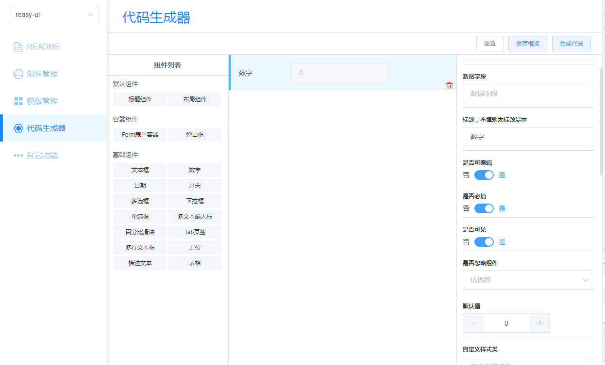
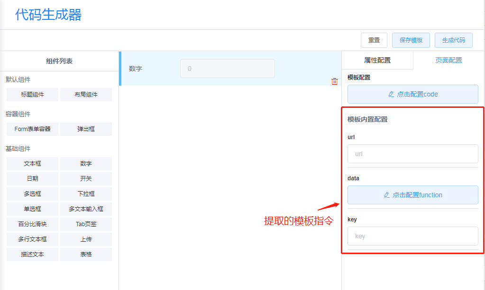

# Reasy-CI

## 功能描述
包含以下功能：
- 框架录入
- 组件录入
- 模板管理
- 业务代码生成

## 代码生成器界面


## 使用说明
通过上传组件的配置来初始化当前可进行使用和配置的组件集，通过在配置页面，进行拖拽组件、修改组件属性进行业务模板的配置，最后通过配置好的模板生成业务代码。上传的组件配置有一定的格式要求，如下所示：

### 配置文件格式

配置文件需要通过`module.exports`输出`generate`和`components`两个模块
```js
module.exports = {
    generate,
    components
}
```
- `generate`: 代码生成配置
- `components`: 组件配置

### 组件配置

组件示例配置如下：
```js
const components = {
    // 组件配置列表
    components: [{
        name: 'FormInput',
        title: '文本框组件',
        showType: '',
        showOption: { // 显示组件时使用
            title: 'dataTitle',
            value: 'defaultValue',
            type: 'type'
        },
        valueType: 'string',
        attrs: {
            type: {
                title: 'type类型',
                valueType: 'enum',
                selectArray: ['text', 'password'],
                required: false,
                defaultValue: 'text'
            }
        }
    }],
    // 组件公共属性
    commonAttrs: {
        elementId: {
            title: '容器id',
            valueType: 'string',
            required: true,
            ignore: true, // 生成代码时不使用该属性
            defaultValue: ''
        }
    }
};
```
其中各属性说明如下：

| 属性 | 值类型 | 必填 | 描述 |
| --- | --- |  --- |   --- | 
| name | String | 是 | 组件的名称，确保唯一 |
| title | String | 是 | 组件显示标题，用于配置界面显示组件的名称 |
| isContainer | Boolean | 否 | 是否是容器组件，默认值`false`，容器组件内部可以设置其他组件 |
| showType | [枚举值](#showType可选列表) | 是 | 组件的预览类型，[点击查看可选值](#showType可选列表) |
| showOption | Object | 是 | 对应于`showType`的显示配置项，[点击查看详情](#showOption) |
| valueType | [枚举值](#valueType) | 否 | 组件的值类型，主要用于组件的默认值设置场景使用，[详情](#valueType) |
| attrs | Object | 是 | 组件的可配置属性集合，其中`key`为属性的名称，`value`为属性值得配置项 |
| 属性值配置 |
| title | string | 是 | 属性描述信息 |
| valueType | [枚举值](#valueType)  | 是 | 属性的值类型，[详情](#valueType) |
| required | Boolean | 否 | 是否必填，默认值`false`(暂时未实现该功能) |
| ignore | Boolean | 否 | 生成代码时不使用该属性，默认值`false` |
| hidden | Boolean | 否 | 是否在属性配置界面隐藏该属性，默认值`false` |
| defaultValue | ALL | 否 | 属性的默认值，也可以是表达式`$[name]`获取对应的主属性的值 |
| selectArray | Array | 否 | 枚举值对应的可选项，valueType为enum时需要且必填 |
| itemType | String/Object | 否 | 列表项的值类型，valueType为array时需要且必填 |
| syncKey | Array | 否 | 同步的属性名称，valueType为`sync`时需要且必填 |


> 注意：在上传配置文件的过程中会对文件的格式进行检查，符合上述标准的配置文件才能上传成功，否则无法上传。该系统正常使用的前提是组件配置文件的正确编写和上传。

### valueType
对应主键或者组件属性的值类型配置，通过配置该值，可以确定页面上该属性的配置通过哪个组件去实现。例如，如果该值配置为`string`，则使用文本框去显示该属性，用户可以通过在输入框中输入对应的文本去配置该属性的值。具体的可选枚举如下：

| valueType | 描述 | 展示 |
| --- | --- |  --- | 
| enum | 枚举 | 通过下拉框展示枚举值供用户选择 |
| number | 数值 | 显示数字输入框 |
| function | 函数 | 显示代码编辑框 |
| string | 字符串 | 显示文本输入框 |
| bool | 布尔值 | 显示开关按钮 |
| array | 数组 | 显示数组配置组件 |
| sync | 同步关键词 | 设定与哪个属性值进行同步 |
| object | 对象 | 显示代码编辑框 |
| code | 代码 | 显示代码编辑框 |

> 作为主属性可使用`2|selectArray`表示从`selectArray`属性的值中选取0个或多个，1表示选取0个或1个。作为属性的`valueType`则只能从上述枚举中选择。

### showType可选列表
用于指定，预览界面中组件的显示demo，设定为不同的值显示为不同的风格

| showType | 描述 |
| --- | --- | 
| input | 文本框 |
| switch | 开关按钮 |
| datetime | 日期选择框 |
| select | 下拉框 |
| checkbox | 复选框，支持多个或单个 |
| radio | 单选框 |
| slider | 可拖动滑块 |
| upload | 上传组件 |
| table | 数据表格 |
| layout | 布局容器，可在将组件拖入容器内部进行配置 |
| label | 文本显示 |

### showOption
针对不同`showType`的预览信息配置项，通过配置该参数，将组件配置的属性实时显示在预览界面中，该配置的值类型为`Object`，其中`key`为`showType`对应的组件需要的属性，`value`该属性对应的组件的配置属性名称。部分组件不需要对应的`showOption`配置各`showType`对应的`showOption`如下

```js
{
    input: {
        title: '显示标题对应的组件属性名称',
        type: 'type对应的属性名称',
        value: '显示值对应的属性名称'
    },
    datepicker: {
        title: '显示标题对应的组件属性名称',
        value: '显示值对应的属性名称'
    },
    switch: {
        title: '显示标题对应的组件属性名称',
        value: '显示值对应的属性名称'
    },
    select:  {
        title: '显示标题对应的组件属性名称',
        value: '显示值对应的属性名称',
        selectArray: '可选项对应的属性'
    },
    checkbox:  {
        title: '显示标题对应的组件属性名称',
        value: '显示值对应的属性名称',
        selectArray: '可选项对应的属性'
    },
    radio:  {
        title: '显示标题对应的组件属性名称',
        value: '显示值对应的属性名称',
        selectArray: '可选项对应的属性'
    },
    slider: {
        title: '显示标题对应的组件属性名称',
        value: '显示值对应的属性名称'
    },
    upload: {
        title: '显示标题对应的组件属性名称'
    },
    table: {
        title: '显示标题对应的组件属性名称'，
        columns: '列属性对应的组件属性名称'
    },
    // 以下为选填项
    选填项: {
        input: {
            multiple: '是否是多文本输入对应的组件属性名称',
            text: '文本框前描述字段对应的组件属性名称',
            inputCount: '文本框个数对应的组件属性名称',
            joiner: "连接符对应的组件属性名称",
            rows: 'type为textarea时，显示的行数对应的组件属性名称'
        },
        radio: {
            isButton: '显示为按钮对应的组件属性名称'
        },
        slider: {
            showInput: '显示文本框对应的组件属性名称'
        },
        upload: { 
            showFileList: '显示文件列表对应的组件属性名称', 
            browseText: "浏览文件按钮文字描述对应的组件属性名称", 
            uploadText: '上传按钮文字描述对应的组件属性名称' 
        }
    }
}
```

## generate配置
组件示例配置如下：
```js
const generate = {
    commonTemplate: '<div id="{elementId}" data-key="{name}">',
    commonScript: `let {elementId} = $('#{elementId}').Rcomponent({attrs});`,
    FormInput: {
        template: '<input id="{elementId}" type="{type}" data-key="FormInput"/>'
    },
    ComponentManager: {
        single: true, // 需要单独处理
        template: '<div id="{elementId}">{for:formCfg}</div>',
        formListData: 'object:dataField:attrs',
        script: `let {elementId} = $.componentManager({attrs});`
    }
    ...
}
```
其中`commonTemplate`和`commonScript`是必填项，分别是组件对应的`html`代码模板和`js`代码模板，该两项为公共模板。如果组件与公共模板保持一致，则不需要单独配置，否则需要单独配置组件对应的模板`template`和`script`，如示例所示。

## 页面代码结构模板
业务代码结构模板示例如下：

```js
import FormPage from "@pages/FormPage";

export default class Page extends FormPage {
    constructor() {
        super(...arguments);
        this.getUrl = "{{url}}";
    }

    init() {
        this.initComponent();
    }

    dataLoaded(data) {
        //自定义
        {{data|function}}
    }

    beforeSubmit(data) {
        //自定义
        {{key}}
    }

    afterSubmit(res) {
  		//自定义
    }

    initComponent() {
      {{js}}
    }
}
```
1. `{{js}}`表示插入业务代码的地方
2. `{{html}}`表示插入标签代码的地方
3. `{{xxx}}`为自定义指令，可以在模板上添加自定义指令，系统通过自动识别指令在界面上生成配置项供用户直接配置，无需在模板中写入特定的内容，指令可通过`|`隔开，前面的表示指令名称，后面表示指令对应的配置显示组件，与[valueType](#valueType)保持一致，如图：


## 未完待续
敬请期待~~